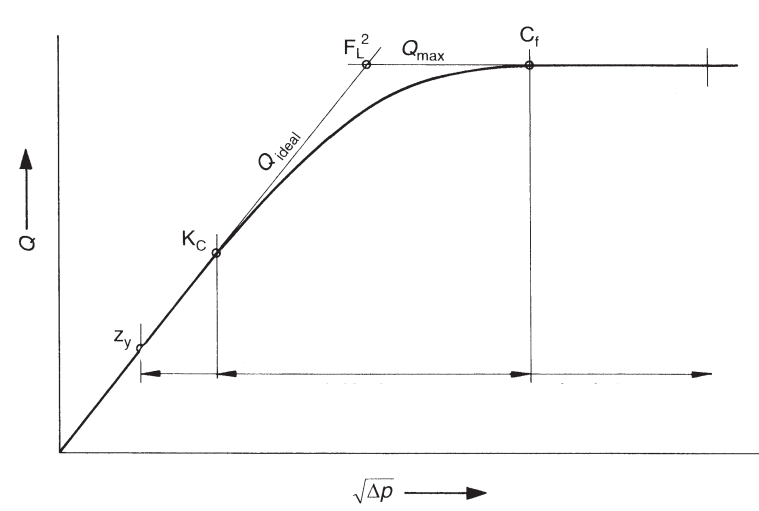

# Quantifying the Cavitation Potential of the valve

Its effect on the system varies with valve type, size, operating pressure, and details of the piping installation. To include cavitation in the design process is necessary to determine if cavitation will ist, evaluate its intensity, characterize the flow conditions, and estimate its effect on the system and environment. Possible consequences include noise, vibration, erosion damage, and a decrease in performance.

To characterize the flow conditions corresponding to a selected level of cavitation requires defining a cavitation index derived from dimensional analysis. The process involves determining the fluid properties, geometric characteristics, and fluid parameters that influence the cavitation process. The main variables affecting the cavitation process are: 

  1. the geometric configuration of the device,
  2. absolute pressure in the cavitating region, 
  3. the critical pressure, generally assumed to be the liquid vapor pressure and 
  4. velocity or pressure drop

## Sigma Values

For a valve, the force suppressing cavitation is proportional to the magnitude of the average pressure relative to absolute vapor pressure i.e. $(P-P_r)$. The force causing cavitation is proportional to the velocity head  $V^2/2g$ or to the pressure drop across the valve $\Delta P$. The resulting cavitation parameter sigma can be expressed as (using absolute units):

$$
\sigma = \frac{P_1-P_v}{\Delta P_{net}}
$$

in which: 

  - $P_1$ is the absolute pressure just upstream from the valve $(P_l = P_u + P_b)$, 
  - $P_u$ is _the gauge pressure just upstream from the valve_, 
  - $P_b$ is _the atmospheric or barometric pressure_, 
  - $P_v$ is _the absolute vapor pressure_ and 
  - $\Delta P_{net}$ _the net pressure drop across the valve_.

The minimum value of sigma ($\sigma$) is $1.0$ since the maximum $\Delta P_{net}$  across the valve is $P_1 - P_v$.

For valves and other devices that create a pressure drop, the cavitation parameter can be defined in several ways. The reference pressure in the numerator of the equation of sigma can be either the upstream or the downstream pressure. Both have been used, and there are valid reasons supporting either choice.

Using the downstream pressure $P_2$, the equation becomes:

$$
\sigma_{1} = \frac{P_2-P_v}{\Delta P_{net}}
$$

In which $P_2$ is the absolute downstream pressure ($P_2 = P_d + P_b$), where $P_d = P_u - \Delta P_{net}$ and $P_b$ is the barometric pressure. 

This is the form originally preferred because the _downstream pressure is the pressure closer to the zone where the cavitation occurs_. Therefore, the downstream pressure more directly influences the cavitation. However, it is more convenient to use the upstream pressure for most applications, and the two sigma values differ by a constant value of $1.0$. The following simple equation directly relates the equation:

$$
\sigma = \sigma_{1} + 1
$$
For cavitation caused by surface roughness, an isolated roughness, an offset in the boundary or by any device for which it is not possible or convenient to evaluate a pressure differential, the velocity head can be used in place of $\Delta{P}$ in Equation of $\sigma$. The resulting equation is:

$$
\sigma_{2} = \frac{P_1-P_v}{(V^2/2g)}
$$

Some authors have chosen to use the reciprocal of Equation for $\sigma$ and have defined the cavitation index as $k_c$ instead of $\sigma$. The equation defining $k_c$ is:

$$
k_c = \frac{1}{\sigma_{1}} = \frac{\Delta P_{net}}{(P_2-P_v)} 
$$

If you want to add a factor of safety to the cavitation parameter $\sigma$ that includes the possible cavitation caused by any device for which it is not possible or convenient to evaluate a pressure differential close to the control valve, then:

$$
\frac{1}{\sigma_{}} + \frac{1}{\sigma_{2}} = \frac{\Delta P_{net}}{(P_1-P_v)} + \frac{(V^2/2g)}{(P_1-P_v)}
$$

$$
\frac{1}{\sigma_{3}} = \frac{1}{\sigma_{}} + \frac{1}{\sigma_{2}} = \frac{\Delta P_{net} + (V^2/2g)}{(P_1-P_v)}
$$

$$
\sigma_{3} = \frac{(P_1-P_v)}{\Delta P_{net} + (V^2/2g)}
$$

## Evaluating the Cavitation Limits of the valve

Cavitation causes noise, pressure fluctuations, vibrations, erosion damage, and in advanced stages, can reduce the valve's capacity. The acceptable cavitation level for a valve in a given system varies with valve type, valve function, details of the piping layout and duration of the operation. 

It is necessary to identify and provide experimental data for several levels of cavitation intensity to have adequate information for analysis and design.  There are defined six different cavitation design limits. The methods used to determine each limit experimentally are described, and suggestions are given as to when each limit might be appropriate. These limits are:

  1. Incipient cavitation $\sigma_{i}$
  2. Critical (or constant) cavitation $\sigma_{c}$
  3. Incipient damage $\sigma_{i_d}$
  4. Incipient choking $\sigma_{i_{ch}}$ (or Kc)
  5. Choked flow $\sigma_{ch}$
  6. Maximum noise and vibration level $\sigma_{max}$
  
## cavitation and flow {.flexbox .vcenter}

## Maximum Flow without fitings

The maximum rate at which flow will pass through a control valve at choked flow [in $m^3/h$] conditions be calculated as follows:

$$
Q_{max} = k_v \cdot F_{L} \cdot F_R \cdot \sqrt{p_1 - F_F \cdot p_v}
$$

Where: 

  - $F_R$ is the Reynolds number factor 
  - $F_L \; and \; F_{LP}$ are the Liquid pressure recovery factors 
  - $F_F$ is the Liquid critical pressure ratio factor 

$$
\Delta P_{max} = {F_L}^2 \cdot (p_1 - F_F \cdot p_v) 
$$

## Maximum Flow with flow limitation and with fitting

$$
Q_{max} = k_v \cdot F_{LP} \cdot F_R \cdot \sqrt{p_1 - F_F \cdot p_v}
$$

$$
\Delta P_{max} = {\left(\frac{F_{LP}}{F_P}\right)}^2 \cdot (P_1 - F_F \cdot p_v) 
$$

