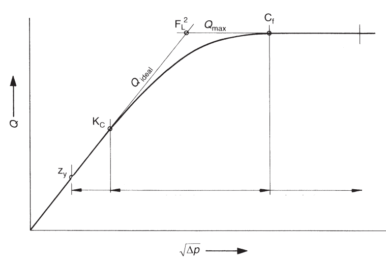

# Evaluating the Cavitation Limits of the valve

Cavitation causes noise, pressure fluctuations, vibrations, erosion damage, and in advanced stages, can reduce the valve's capacity. The acceptable cavitation level for a valve in a given system varies with valve type, valve function, details of the piping layout and duration of the operation. 

It is necessary to identify and provide experimental data for several levels of cavitation intensity to have adequate information for analysis and design.  There are defined six different cavitation design limits. The methods used to determine each limit experimentally are described, and suggestions are given as to when each limit might be appropriate. These limits are:

  1. Incipient cavitation $\sigma_{i}$
  2. Critical (or constant) cavitation $\sigma_{c}$
  3. Incipient damage $\sigma_{i_d}$
  4. Incipient choking $\sigma_{i_{ch}}$ (or Kc)
  5. Choked flow $\sigma_{ch}$
  6. Maximum noise and vibration level $\sigma_{max}$
  
## cavitation and flow {.flexbox .vcenter}

## Maximum Flow without fitings

The maximum rate at which flow will pass through a control valve at choked flow [in $m^3/h$] conditions be calculated as follows:

$$
Q_{max} = k_v \cdot F_{L} \cdot F_R \cdot \sqrt{p_1 - F_F \cdot p_v}
$$

Where: 

  - $F_R$ is the Reynolds number factor 
  - $F_L \; and \; F_{LP}$ are the Liquid pressure recovery factors 
  - $F_F$ is the Liquid critical pressure ratio factor 

$$
\Delta P_{max} = {F_L}^2 \cdot (p_1 - F_F \cdot p_v) 
$$

## Maximum Flow with flow limitation and with fitting

$$
Q_{max} = k_v \cdot F_{LP} \cdot F_R \cdot \sqrt{p_1 - F_F \cdot p_v}
$$

$$
\Delta P_{max} = {\left(\frac{F_{LP}}{F_P}\right)}^2 \cdot (P_1 - F_F \cdot p_v) 
$$

